# 从零开始在 VSCode 中搭建一个 cmake c++ 项目

## 操作系统: MacOs

## VSCode里需要安装的插件:
 
 CMAKE

 CMake Tools

 * 貌似 CMake Tools 用的 generator 是 ninja, 可以在 terminal 安装一下 ninja:
    
        brew install ninja

## 步骤:

1) 新建一个文件夹(比如 test), 然后用 code 打开:

    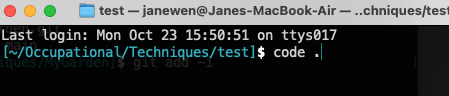

2) 在VSCode里, Test目录下, 新建两个文件: main.cpp 和 CMakeLists.txt:

    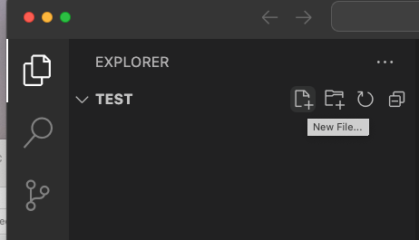

    main.cpp 就写成helloworld就好; CMakeLists.txt 的内容如下:

    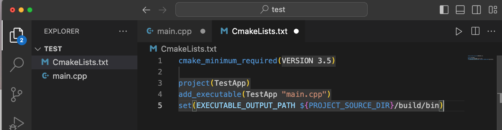

    其中第5行设置了将来生成的可执行文件的位置, 是当前工程目录下的 build/bin, 虽然现在还没建 build 目录, 但是 CMake Tools 会自动建; 当然现在手动建了 build 文件夹也可以, 不会影响 CMake Tools 的工作.

3) 看一下VSCode左边的面板有没有出现 CMake Tools 的图标 (如下图左边小的红框内所示), 如果没出现, 把 VSCode 关掉, 重新进去, 应该就会有了;

    CMake Tools 会自动执行“配置”, 即, 执行 CMakeLists.txt 里的命令 (output), 如下图大的红框所示.

    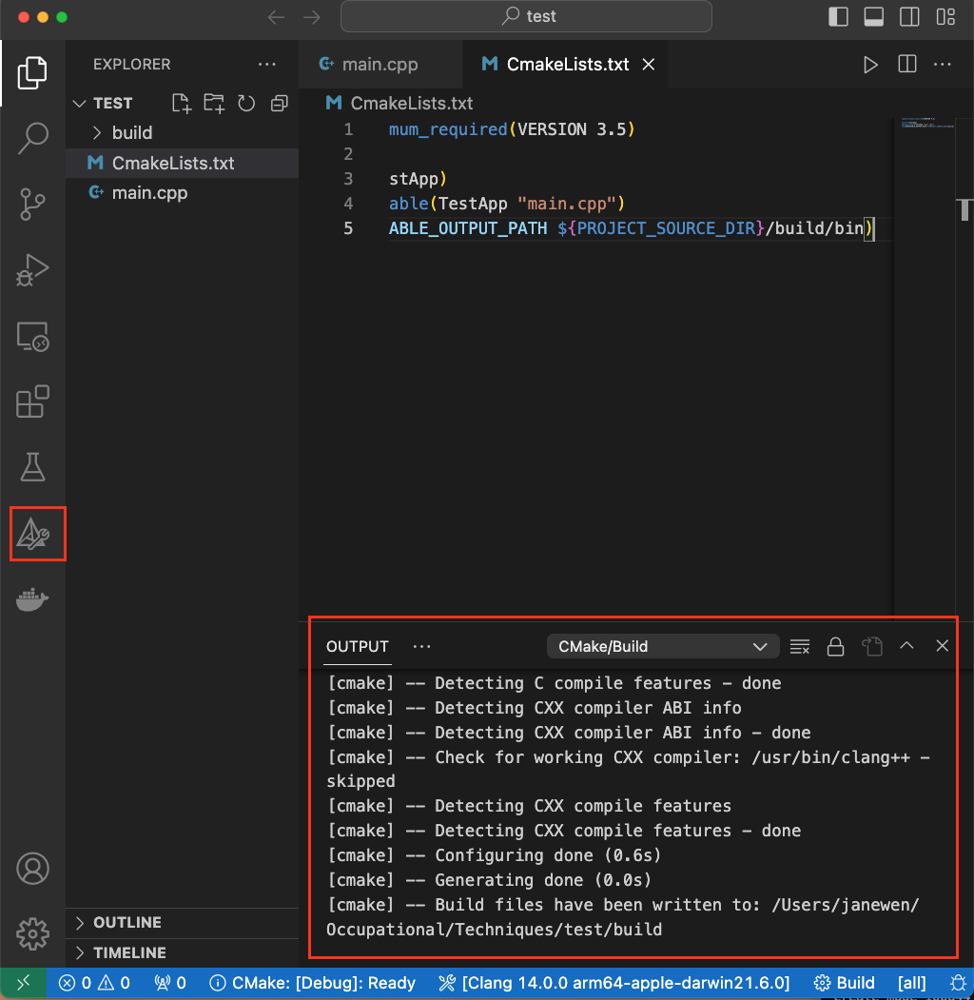

    如果没有自动执行, 可以按下图所示的按钮(第一个按钮), 手动执行.

    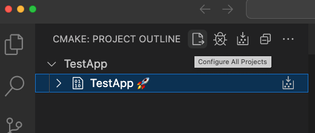

    执行结果就是会出来 build 目录和里面的一堆文件:

    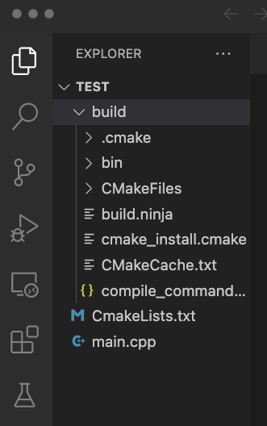

4) 找到“Run and Debug”, 新建一个 launch.json 文件:

    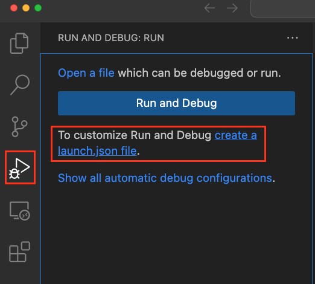

    它会让你选择debugger, 根据自己的操作系统选择即可:  

    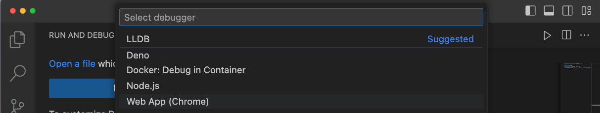

    修改 launch.json 文件中的内容:

    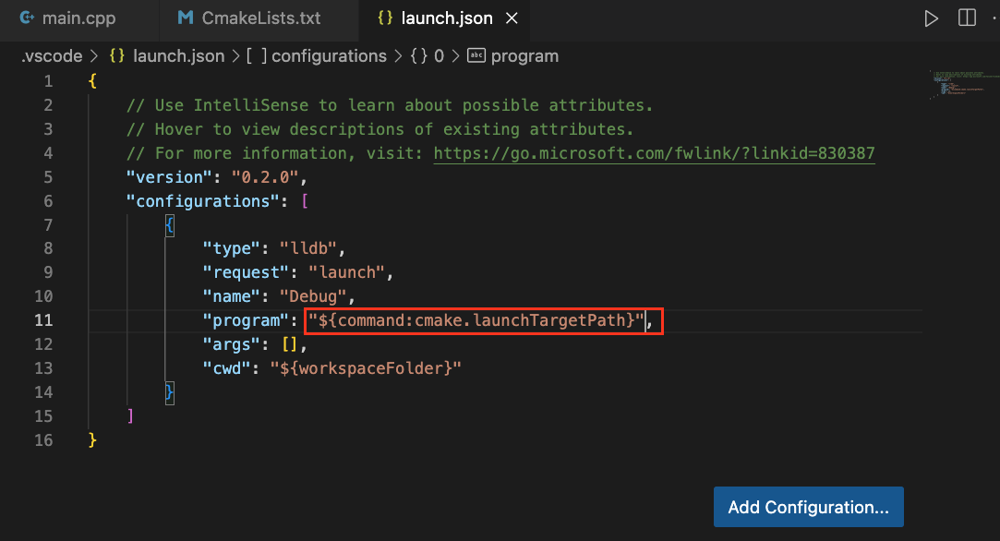

    “command:cmake.launchTargetPath” 这句话是说, 可执行文件的路径由cmake提供. 

5) Build and Debug:
    
    如图所示的这两个按钮都可以 build:

    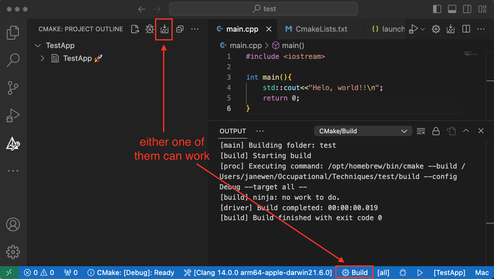

    build 成功就可以断点调试啦:

    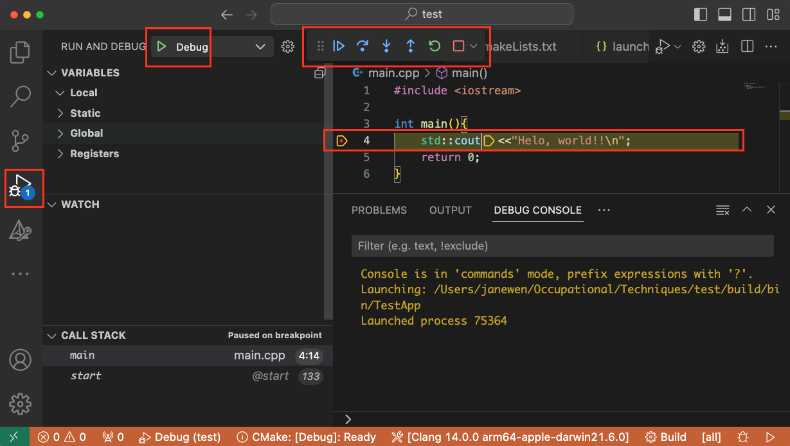

## 附上以上的工程:

    link: suppliments/VSCode_CMake/test.zip

## ref

https://zhuanlan.zhihu.com/p/144376188

https://www.cnblogs.com/tengzijian/p/17626969.html

https://juejin.cn/s/vscode%20cmake%20launch.json

https://elloop.github.io/tools/2016-04-10/learning-cmake-2-commands

