# 从零开始在 VSCode 中搭建一个 cmake c++ 项目

操作系统: MacOs

步骤:

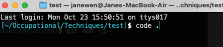

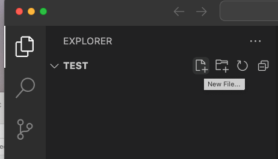

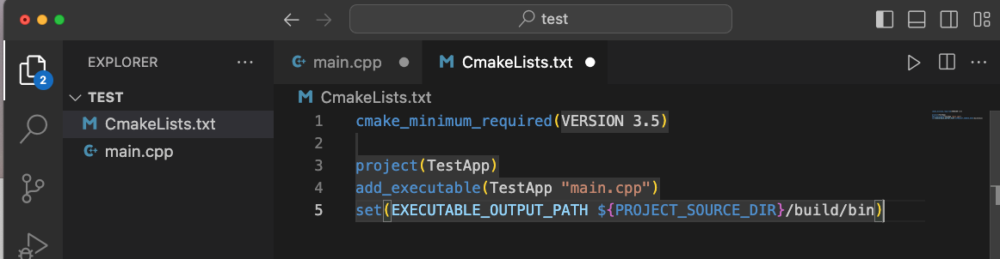

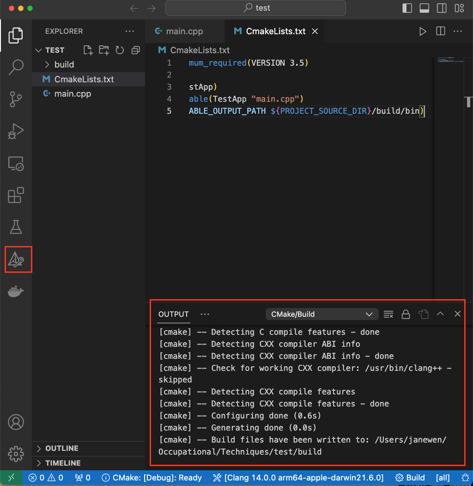

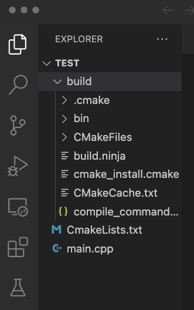

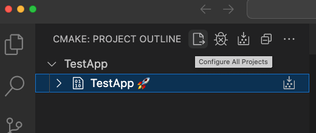

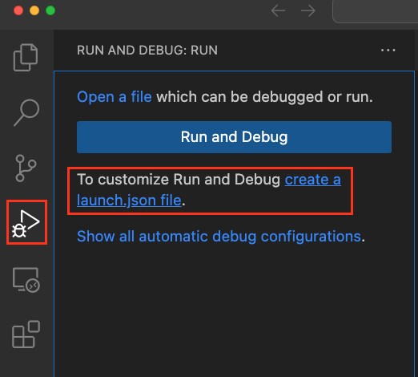

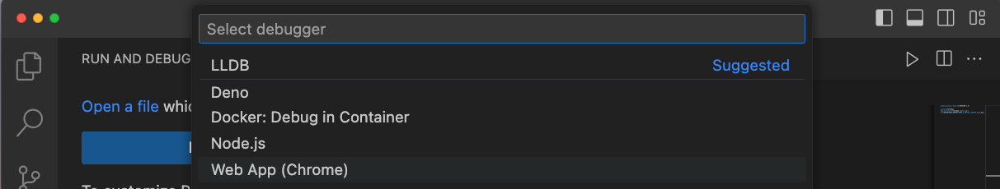

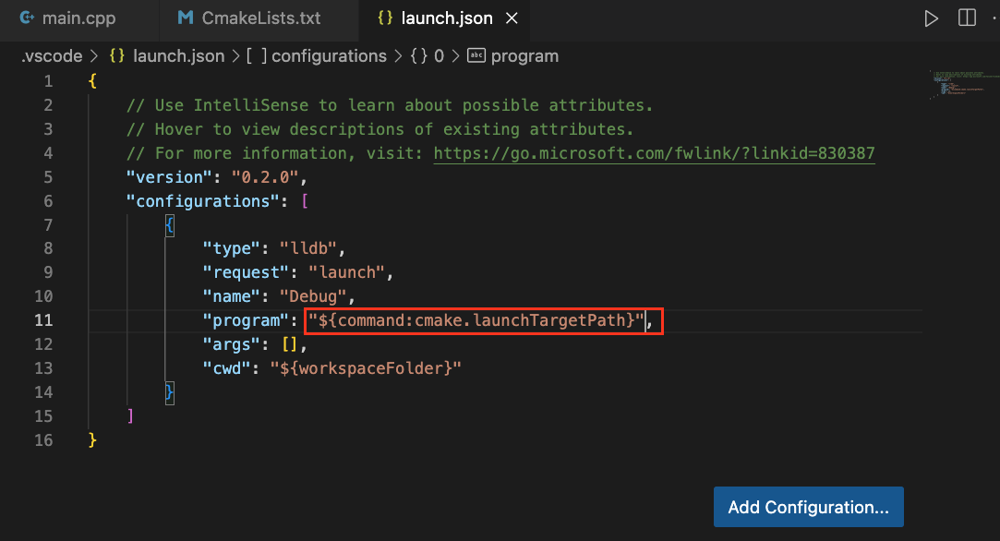

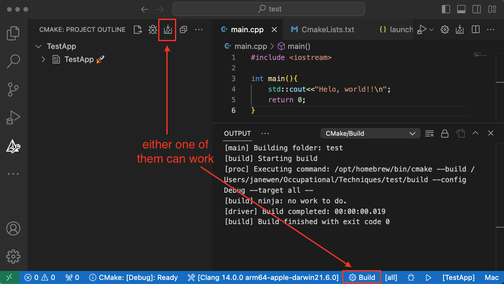

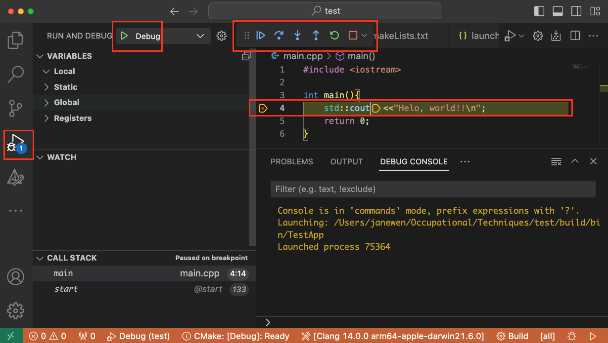

ref

https://zhuanlan.zhihu.com/p/144376188

https://www.cnblogs.com/tengzijian/p/17626969.html

https://juejin.cn/s/vscode%20cmake%20launch.json

https://elloop.github.io/tools/2016-04-10/learning-cmake-2-commands

